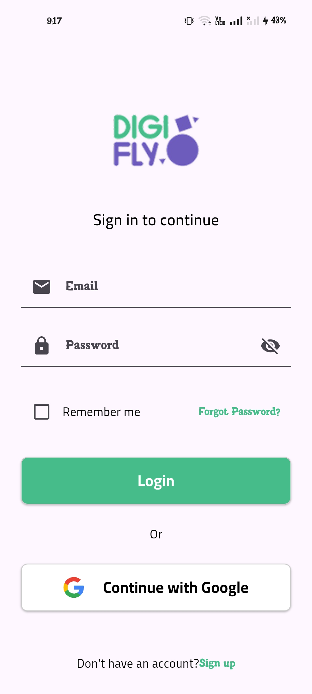
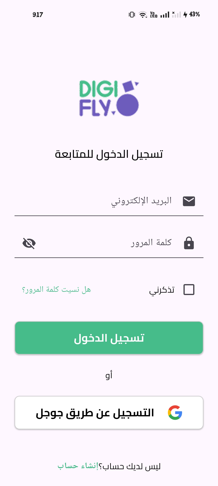
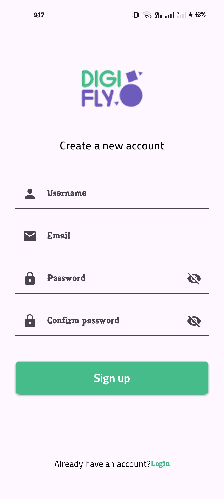
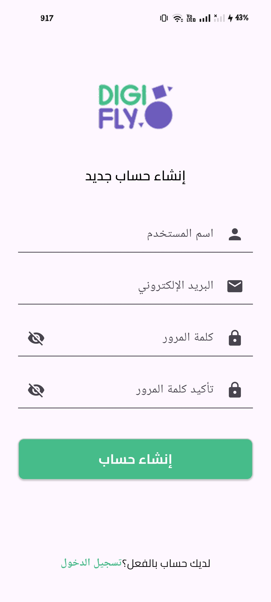
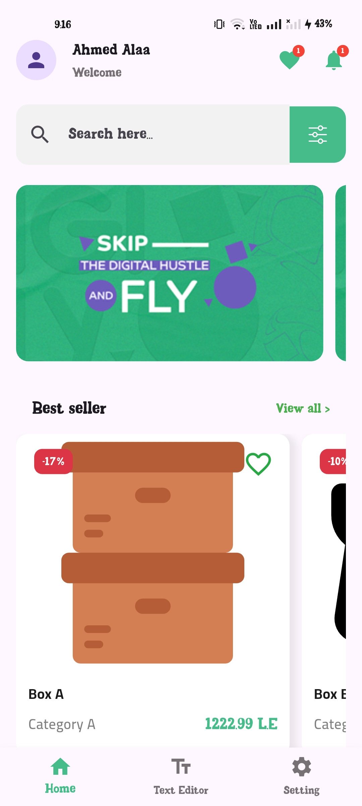
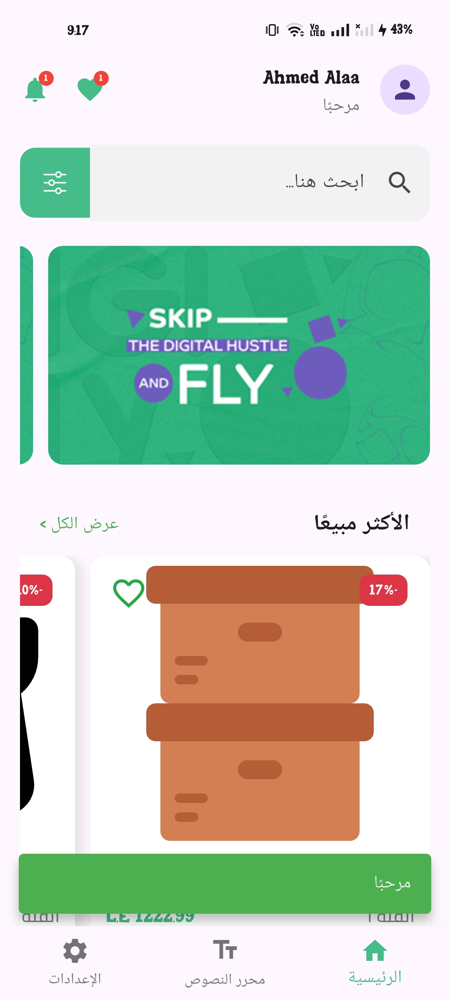
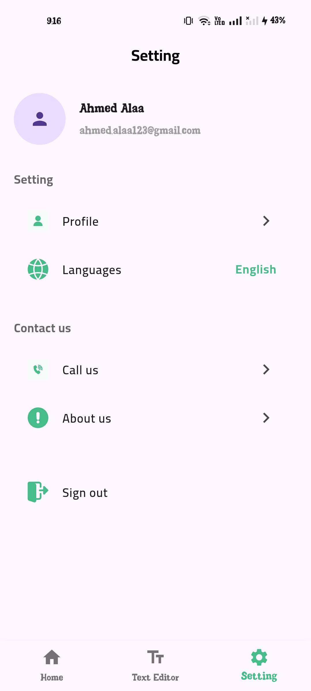
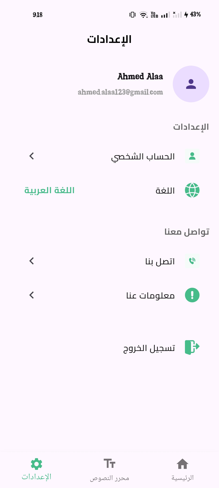
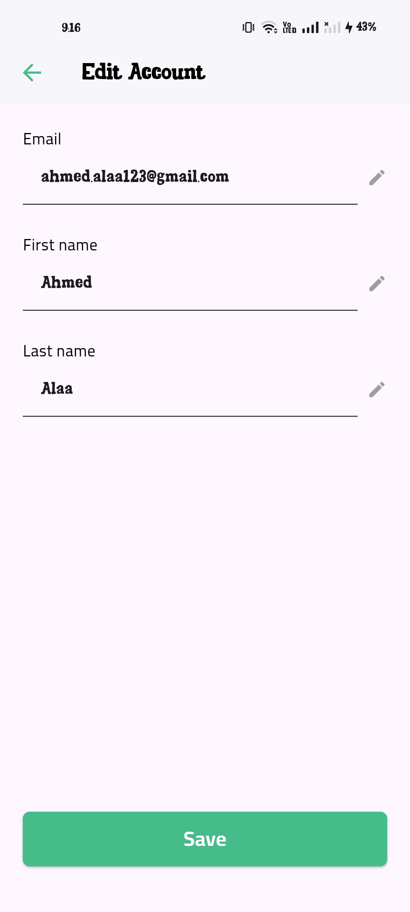
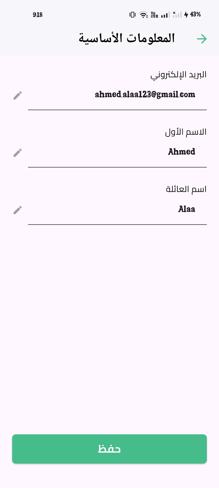

# Digifly Mobile App

## Overview

This repository contains the solution for the Mobile App Development Assessment Task. [cite_start]This project showcases my capabilities in Flutter development, including problem-solving skills, coding style, and understanding of best practices, by delving into real-world mobile app scenarios.

## Features Implemented

[cite_start]This application is built with a strong focus on responsiveness and internationalization [cite: 4, 5][cite_start], supporting both English and Arabic languages for a seamless user experience across different locales and screen sizes.

### Part 1: User Authentication - Login and Signup Pages
* [cite_start]**Secure Authentication System:** Implemented robust Login and Signup pages.
* [cite_start]**User-Friendly Interface:** Designed with a clean and intuitive UI.
* [cite_start]**Comprehensive Form Validation:** Includes validations for required fields, email format, password strength, and confirmation matching during signup.
* [cite_start]**Clear Error Messaging:** Provides helpful error messages for invalid inputs to enhance user experience.
* [cite_start]**Hardcoded Mock Map Like JSON having key and value:** Integrated authentication process with a local, hardcoded Mock Map for user data management.
* [cite_start]**Seamless Language Switching:** Fully supports dynamic language switching between English and Arabic.

| Login Screen (English) | Login Screen (Arabic) |
|---|---|
|  |  |

| Signup Screen (English) | Signup Screen (Arabic) |
|---|---|
|  |  |

### Part 2: Home Screen Implementation
* [cite_start]**Dynamic UI:** Created a visually appealing and responsive home screen.
* [cite_start]**Custom Navigation:** Features a custom app bar and a bottom navigation bar for easy navigation.
* **Horizontal Lists with Mock Map like JSON Data:**
    * [cite_start]Implemented a horizontal list of images that fetches data from the same hardcoded JSON file you used in Part 1.
    * [cite_start]Created a horizontal list of products, also sourced from the JSON file, displayed below the image list.
* **Adaptive Layout for RTL/LTR:** Ensures UI elements like the search bar and product list scroll direction adapt correctly based on the application's language (English LTR, Arabic RTL) for an intuitive user experience.

| Home Screen (English) | Home Screen (Arabic) |
|---|---|
|  |  |

### Part 3: Text Editor Implementation
* [cite_start]**Custom Text Editor:** Developed a functional text editor adhering to the provided Figma design.
* [cite_start]**Undo/Redo Functionality:** Implemented Undo and Redo buttons from scratch, demonstrating an understanding of state management.
* [cite_start]**Enhanced Usability:** Implemented two additional functionalities (Word Count and Text Formatting).

*(Add screenshot for Text Editor here if available, e.g.:)*
### Part 4: Settings Page Implementation
* [cite_start]**User Data Display:** Created a settings page responsible for displaying user data and profile information.
* [cite_start]**Profile Settings Navigation:** Includes a dedicated section for navigating to different profile settings and options.
* [cite_start]**Secure Sign-Out:** Implemented a functional sign-out button for secure user logout.
* [cite_start]**App Language Preferences:** Provided an option to edit the app's language preferences, with full support for English and Arabic.

| Settings Page (English) | Settings Page (Arabic) |
|---|---|
|  |  |

### Part 5: Edit Account Page Implementation
* [cite_start]**User Information Update:** Developed an "Edit Account" page that allows users to update their personal information, including their email, first name, and last name.
* [cite_start]**Intuitive Interface:** The interface is intuitive and easy to navigate, ensuring a smooth user experience.
* [cite_start]**Email Validation & Feedback:** Includes validation for the email field and provides clear feedback for any required changes.
* [cite_start]**Confirmation Messages:** Users should be able to save their updates and see a confirmation message upon successful changes.

| Edit Account Page (English) | Edit Account Page (Arabic) |
|---|---|
|  |  |

## Technical Details & Best Practices

* **State Management:** Implemented Cubit state management in TextEditor Screen to separate the big logic of it from the UI for managing Screen state and SetState in AUTH screens.
**Responsiveness:** Implemented UI adaptable to various screen sizes using Flutter's layout widgets and techniques.
**Internationalization:** Full support for English and Arabic with seamless switching, impacting text, layout direction (RTL/LTR), and element positioning.
**Error Handling:** Implemented clear error messages for input validations to improve user experience.

