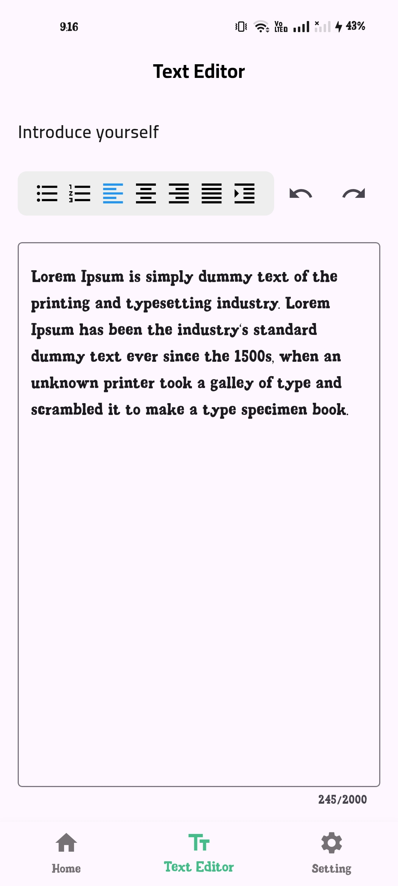

# Digifly Mobile App


## Overview

This repository contains the solution for the Mobile App Development Assessment Task. This project showcases my capabilities in Flutter development, including problem-solving skills, coding style, and understanding of best practices, by delving into real-world mobile app scenarios.

## Features Implemented

This application is built with a strong focus on responsiveness and internationalization, supporting both English and Arabic languages for a seamless user experience across different locales and screen sizes.

### Part 1: User Authentication - Login and Signup Pages
* **Secure Authentication System:** Implemented robust Login and Signup pages.
* **User-Friendly Interface:** Designed with a clean and intuitive UI.
* **Comprehensive Form Validation:** Includes validations for required fields, email format, password strength, and confirmation matching during signup.
* **Clear Error Messaging:** Provides helpful error messages for invalid inputs to enhance user experience.
* **Seamless Language Switching:** Fully supports dynamic language switching between English and Arabic.
* **Hardcoded Mock Map Like JSON having key and value:** Integrated authentication process with a local, hardcoded Mock Map for user data management. This mock data simulates user credentials and existing user information for authentication and signup validation:
    ```dart
    // Testing SignIn Functionality by providing local Credentials
      'admin@digifly.com': 'admin123',
      'user@digifly.com': 'user123',
      'test@digifly.com': 'test123',
   

    // Testing SignUP Functionality by providing local Email for existing user information for authentication and signup validation
      'john.doe@example.com',
      'jane.smith@example.com',
      'admin@digifly.com',
    

   // usernames in signup validation
      'johndoe',
      'janesmith',
      'admin',

    ```
    You can verify the sign-in functionality using the provided `_mockCredentials`. For sign-up validation, you can test with emails and usernames from `_existingEmails` and `_existingUsernames` to see existing user errors.


| Login Screen (English) | Login Screen (Arabic) |
|---|---|
|  |  |

| Signup Screen (English) | Signup Screen (Arabic) |
|---|---|
|  |  |
### Part 2: Home Screen Implementation
* **Dynamic UI:** Created a visually appealing and responsive home screen.
* **Custom Navigation:** Features a custom app bar and a bottom navigation bar for easy navigation.
* **Horizontal Lists with Mock Map like JSON Data:**
    * Created a horizontal list of products, also sourced from the JSON file, displayed below the image list.
* **Adaptive Layout for RTL/LTR:** Ensures UI elements like the search bar and product list scroll direction adapt correctly based on the application's language (English LTR, Arabic RTL) for an intuitive user experience.

| Home Screen (English) | Home Screen (Arabic) |
|---|---|
|  |  |

### Part 3: Text Editor Implementation
* **Custom Text Editor:** Developed a functional text editor adhering to the provided Figma design.
* **Undo/Redo Functionality:** Implemented Undo and Redo buttons from scratch, demonstrating an understanding of state management.
* **Enhanced Usability:** Implemented two additional functionalities (Word Count and Text Formatting).

| Text Editor Screen (English) | Text Editor Screen (Arabic) |
|---|---|
|  |  |


### Part 4: Settings Page Implementation
* **User Data Display:** Created a settings page responsible for displaying user data and profile information.
* **Profile Settings Navigation:** Includes a dedicated section for navigating to different profile settings and options.
* **Secure Sign-Out:** Implemented a functional sign-out button for secure user logout.
* **App Language Preferences:** Provided an option to edit the app's language preferences, with full support for English and Arabic.

| Settings Page (English) | Settings Page (Arabic) |
|---|---|
|  |  |

### Part 5: Edit Account Page Implementation
* **User Information Update:** Developed an "Edit Account" page that allows users to update their personal information, including their email, first name, and last name.
* **Intuitive Interface:** The interface is intuitive and easy to navigate, ensuring a smooth user experience.
* **Email Validation & Feedback:** Includes validation for the email field and provides clear feedback for any required changes.
* **Confirmation Messages:** Users should be able to save their updates and see a confirmation message upon successful changes.

| Edit Account Page (English) | Edit Account Page (Arabic) |
|---|---|
|  |  |

## Technical Details & Best Practices

* **State Management:** Implemented Cubit state management in TextEditor Screen to separate the big logic of it from the UI for managing Screen state and SetState in AUTH screens.
* **Responsiveness:** Implemented UI adaptable to various screen sizes using Flutter's layout widgets and techniques.
* **Internationalization:** Full support for English and Arabic with seamless switching, impacting text, layout direction (RTL/LTR), and element positioning.
* **Error Handling:** Implemented clear error messages for input validations to improve user experience.
* **Vector Graphics (SVG):** Utilized the `flutter_svg` package for rendering scalable vector graphics. This approach significantly contributes to:
    * **Reduced App Size:** SVG files are generally smaller than raster images (PNG, JPEG) for complex graphics, especially icons and illustrations.
    * **Scalability without Quality Loss:** Ensures images look crisp and clear on all screen sizes and resolutions without pixelation.
    * **Performance Optimization:** Efficient rendering of vector assets, leading to smoother UI.


